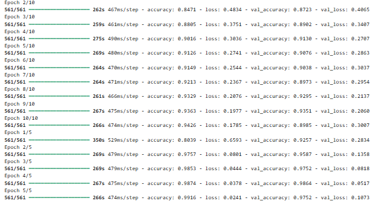

# Driver Distraction Detection – Project Report

## Abstract

Driver distraction is a leading cause of road accidents worldwide. This project introduces a deep learning solution to automatically detect distracted driving behaviors from images and live webcam feeds. The system leverages a MobileNetV2-based CNN for classification and is deployed through Flask applications. It provides severity-based feedback, visual indicators, and audible buzzer alerts to warn drivers of unsafe behaviors, creating a practical and adaptable tool for improving road safety.

---

## Introduction

The widespread use of smartphones and in-car infotainment systems has amplified the problem of distracted driving, which significantly increases accident risk. Traditional methods for monitoring drivers—such as manual observation or proprietary in-car systems—are often ineffective, expensive, or unavailable in older vehicles.

This project addresses the issue by developing an AI-powered driver monitoring system. The solution is capable of classifying unsafe behaviors into multiple categories, delivering real-time alerts through a user-friendly web interface. It supports both static image analysis and live detection via webcam, ensuring accessibility for personal and commercial use.

---

## Objectives

* Detect and classify distracted driving behaviors using deep learning.
* Provide real-time alerts with severity indicators (safe, medium, high risk).
* Enable interaction through a responsive web interface with support for both images and webcam streams.
* Integrate an audible buzzer for unsafe predictions.
* Support deployment in individual, fleet management, and research scenarios.

---

## Existing System

Existing driver monitoring systems face several limitations:

* Manual observation is unreliable and subjective.
* Proprietary distraction detection solutions are costly and limited to premium vehicles.
* Lack of adaptability for older or commercial fleets.

This creates the need for a cost-effective, scalable, and open-source system that is accessible to a wider audience.

---

## Proposed System

The proposed system integrates deep learning and computer vision into a practical driver monitoring tool. It is built on the following components:

* **MobileNetV2-based CNN** trained on the Distracted Driver dataset.
* **9 distraction classes** supported (with “hair and makeup” removed).
* **Severity-based alerts** displayed through color-coded UI (green, orange, red).
* **Buzzer alerts** triggered for unsafe actions.
* **Two deployment options**: Flask (modern, multi-page app) and Streamlit (fast prototyping app).
* **Support for both image uploads and live webcam detection**.

---

## System Requirements

### Software

* Python 3.8+
* TensorFlow, Keras, OpenCV, Flask, Streamlit (optional), NumPy, Pandas, Matplotlib
* Pre-trained model: `models/driver_distraction_model.h5`
* Any modern browser

### Hardware

* Standard system with at least 4GB RAM (GPU recommended for training).
* Webcam (optional, for live detection).

---

## Design and Methodology

### System Architecture

```
User ──> Web App (Flask)
     │
     ▼
   Image Preprocessing
     │
     ▼
   Deep Learning Model (MobileNetV2)
     │
     ▼
Prediction & Severity Logic
     │
     ▼
UI Feedback & Buzzer Alert
```

### Workflow

1. The user uploads an image or enables webcam mode.
2. The system preprocesses the input and passes it to the CNN model.
3. The model predicts the driver activity class.
4. Severity is mapped: safe / medium / high risk.
5. The UI displays the result and triggers a buzzer for unsafe actions.

---

## Execution Process

### 1. Setup

```bash
git clone <repository_url>
cd Driver-Detection
python -m venv venv
.\venv\Scripts\activate   # Windows
source venv/bin/activate  # Linux/Mac
pip install -r requirements.txt
```

### 2. Place Model

Ensure `driver_distraction_model.h5` is inside the `models/` directory.

### 3. Run Flask App

```bash
python flask_app.py
```

Open: [http://localhost:5000](http://localhost:5000)

### 4. Usage

* Upload an image or enable webcam mode.
* The system will display the detected activity.
* Unsafe actions trigger a buzzer and severity-based UI change.

---

## Results

### Model Performance

* Validation accuracy: \~98% after fine-tuning.
* Strong generalization with low validation loss.
* Robust classification across 9 classes.

### Training Metrics (MobileNetV2)

| Epoch | Accuracy | Val\_Accuracy | Loss   | Val\_Loss |
| ----- | -------- | ------------- | ------ | --------- |
| 1     | 0.5186   | 0.7987        | 1.4185 | 0.6122    |
| 5     | 0.9126   | 0.9076        | 0.2741 | 0.2863    |
| 10    | 0.9426   | 0.8985        | 0.1785 | 0.3007    |
| 15    | 0.9916   | 0.9752        | 0.0241 | 0.1073    |



### Inference Output

* Safe driving → Green UI, silent.
* Medium risk (e.g., texting) → Orange UI, buzzer alert.
* High risk (e.g., reaching behind) → Red UI, buzzer alert.

---

## Conclusion

This project demonstrates an effective and accessible driver distraction detection system using deep learning. Achieving over 98% accuracy, it successfully identifies unsafe driving behaviors and alerts drivers in real-time.

The solution is:

* **Practical**: Runs on consumer hardware with browser-based apps.
* **Scalable**: Can be deployed in personal, fleet, or research contexts.
* **Adaptable**: Open-source and extendable to additional classes or datasets.

### Future Work

* Deploying on embedded devices such as Raspberry Pi for in-vehicle use.
* Integrating with IoT systems for fleet-wide monitoring.
* Expanding the dataset to cover more distraction categories.
